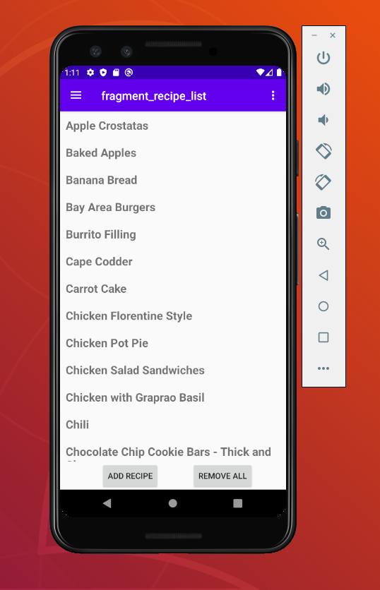

# Recipe Browser
The Recipe Browser Android app can collect recipes stored as text files from an online directory and cache them on the device. It allows recipes to have a more pleasant look and adjust to the size and orientation of your screen, as well as accessing them when the Internet is not available.

## Current online connection options:
Recipes can be stores as .txt files on an Apache server that includes the directory listing capability. An example can be seen (and entered as the host name in the app settings) at https://jumptuck.com/recipes

## Online connection options under development:
Currently in development is the option to store recipes are text files on Google Drive

## App Details:
This code available via the [MIT License](LICENSE)

Please read the [Recipe Browser privacy policy](PrivacyPolicy.md)

## Development Details:
Written in Kotlin using Android Studio

Compiled APK will be avialble once the development reaches stable

